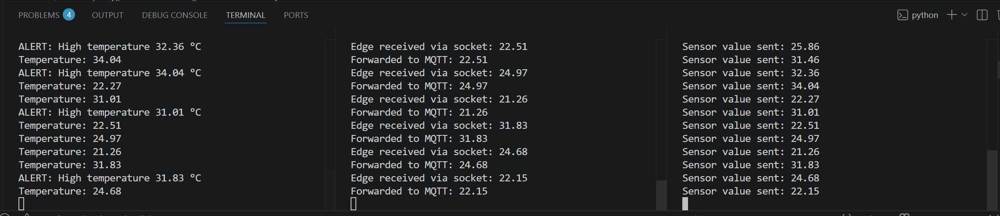
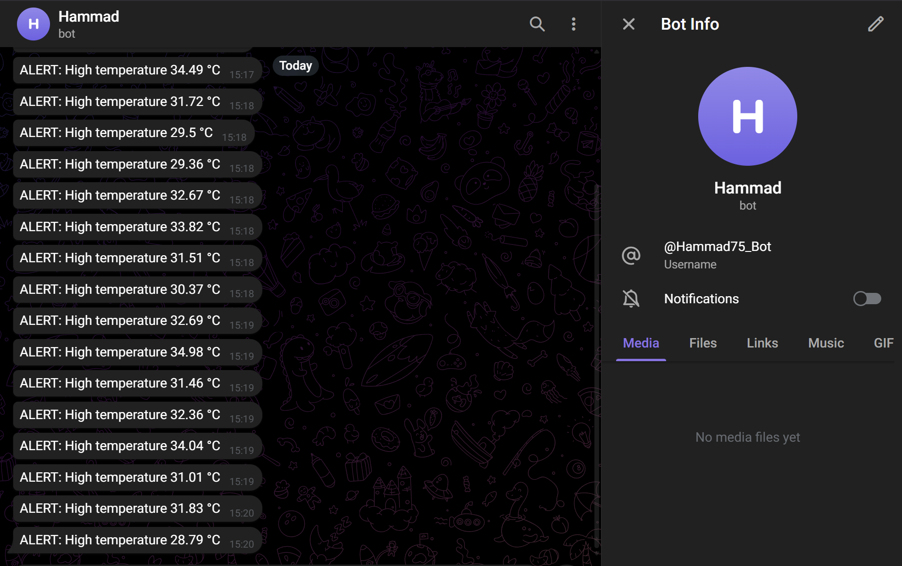

# IoT Data Pipeline & Telegram Alert System

This repository contains a completed IoT communication pipeline that simulates a real-time monitoring and alert system. The project demonstrates a full data flow: a sensor sends data to an edge device via sockets, which is then published to the cloud via MQTT and monitored for high-temperature alerts.

## System Architecture Diagram

The system follows a three-stage architecture to process and monitor environmental data:

```text
  [ Sensor Node ]                 [ Edge Device ]                 [ Cloud Server ]
(socket_sensor.py)               (edge_device.py)            (mqtt_alert_subscriber.py)
        |                               |                               |
        |======= Local Socket =========>|                               |
        |    (Port 5000)                |                               |
        |                               |======== MQTT Publish ========>|
        |                               |     (broker.emqx.io)          |
                                                                        |
                                                                 [ Telegram API ]
                                                                        |
                                                                  [ Mobile Alert ]
```

## How the System Works

1. **Sensor Node:** Simulates a hardware sensor by generating random temperature readings (20°C - 35°C) and transmitting them over a local TCP socket.
2. **Edge Device:** Acts as a gateway that receives local socket data and "bridges" it to the internet by publishing the values to a public MQTT broker.
3. **Cloud Subscriber:** A monitoring service that subscribes to the MQTT topic. It parses the data and compares it against a threshold (28.0°C). If the limit is exceeded, it triggers an automated alert to a mobile device via the Telegram Bot API.

## Configuration Details
* **MQTT Broker:** `broker.emqx.io`
* **MQTT Topic:** `savonia/iot/temperature`
* **Threshold:** 28.0°C

## Project Screenshots

### 1. System Integration


### 2. Telegram Alert


## Reflection Question

**Why is MQTT useful for building monitoring and alert systems in IoT?**

MQTT is highly efficient for IoT alert systems because it is lightweight and designed for low-bandwidth, high-latency environments. Unlike traditional web protocols where a client must constantly "poll" or ask for updates, MQTT's Publish/Subscribe model allows the Cloud Subscriber to remain idle until the exact moment new data arrives. This ensures real-time responsiveness for critical alerts while significantly reducing the power and data consumption of the connected devices.

## Execution Order

To run the system, open three terminals and start the scripts in this order:
1. `python mqtt_alert_subscriber.py`
2. `python edge_device.py`
3. `python socket_sensor.py`
