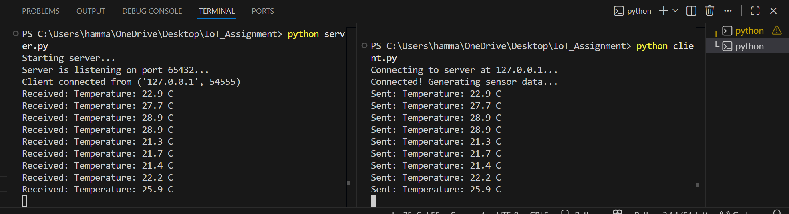

# Simple TCP Client-Server Communication

## Project Description
This project demonstrates the fundamentals of network programming using Python's `socket` library. It consists of a TCP server that listens for incoming connections and a TCP client that simulates an IoT temperature sensor. The client connects to the server and transmits a randomized temperature string every 5 seconds.

## How to Run the Code
1. Open a terminal and run the server first:
   `python server.py`
2. Open a second terminal (or use a second computer on the same network) and run the client:
   `python client.py`
*(Note: If running on a second computer, open `client.py` and change the `SERVER_IP` variable to the host machine's IPv4 address).*

## Test Results

**Test 1: Localhost (127.0.0.1)**
The system was tested on a single machine using the local loopback address. The client successfully connected to the server, and the 5-second interval data transmission worked perfectly.

**Test 2: Second Device Network Test**
The system was tested across a local network using two devices. The server's `HOST` was bound to `0.0.0.0` to accept external connections. The client device was updated with the server's local IP address. The connection was successfully established over the network, and the data packets were received reliably every 5 seconds without dropouts.

## System Screenshot
 
