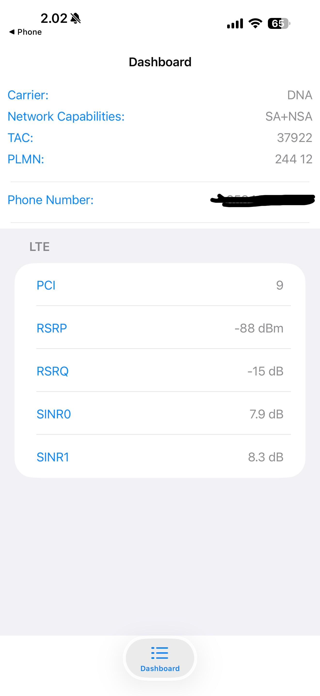

## 1. Objective
To explore and analyze cellular network parameters using the smartphone service mode (Field Test Mode) to understand signal strength, quality, and network reliability.

## 2. Experiment Setup and Test Location
* **Device:** Apple iPhone
* **Access Method:** Field Test Mode (dialed `*3001#12345#*`)
* **Carrier:** DNA (Finland, PLMN: 244 12)
* **Network Technology:** LTE (with 5G SA+NSA capabilities)
* **Test Location:** Kuopio, Finland (Indoors)

## 3. Collected Measurement Data

| Parameter | Value | Description |
| :--- | :--- | :--- |
| **Technology** | LTE | 4G Long Term Evolution |
| **Capabilities**| SA+NSA | Standalone and Non-Standalone supported |
| **PCI** | 9 | Physical Cell ID |
| **RSRP** | -88 dBm | Signal Strength (Reference Signal Received Power) |
| **RSRQ** | -15 dB | Signal Quality (Reference Signal Received Quality) |
| **SINR0** | 7.9 dB | Signal-to-Interference-plus-Noise Ratio (Antenna 0) |
| **SINR1** | 8.3 dB | Signal-to-Interference-plus-Noise Ratio (Antenna 1) |

## 4. Analysis and Observations
* **Signal Strength (RSRP):** At **-88 dBm**, the signal strength is **good/strong**. This indicates the device is relatively close to the cell tower and physical obstructions (like walls or building materials) are not severely degrading the absolute power of the signal. 
* **Signal Quality (RSRQ):** At **-15 dB**, the signal quality is **moderate/fair**. While the raw signal is strong, the RSRQ indicates there is network noise, interference, or high network load present on this specific cell.
* **Signal-to-Interference-plus-Noise Ratio (SINR):** At **~8 dB** (averaging SINR0 and SINR1), the signal is moderately stronger than the background noise. This supports a stable connection and acceptable data throughput, but it is not high enough to achieve the maximum peak data speeds the network is capable of.
* **Impact on Connectivity:** The combination of strong RSRP but moderate RSRQ/SINR suggests that the connection reliability is excellent (low risk of dropping the connection), but data speed and network stability might occasionally fluctuate due to local network congestion or RF interference rather than distance from the cell tower.

## 5. Conclusions
The data collected demonstrates a highly reliable LTE connection on the DNA network. The primary factor limiting peak network performance in this specific location is interference and network load (reflected by moderate RSRQ and SINR) rather than signal attenuation from physical distance or building materials (reflected by the strong -88 dBm RSRP). The network connection is stable, but data speeds are likely average rather than optimal due to environmental noise.
