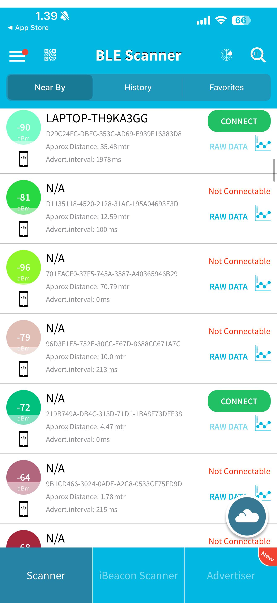
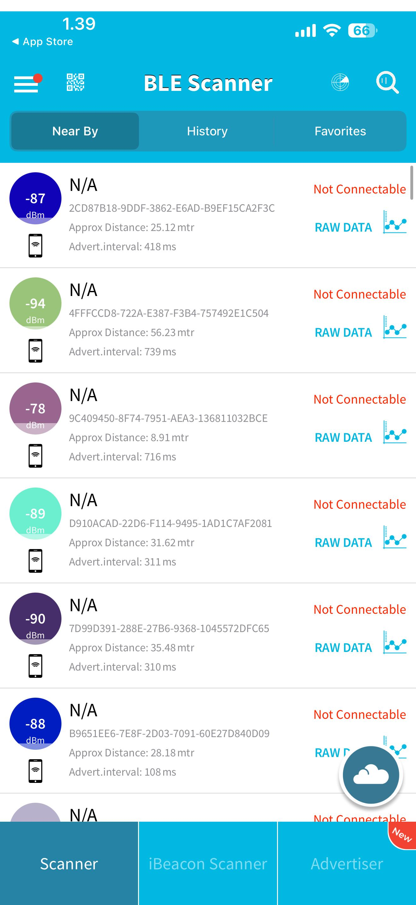

# BLE Device Environmental Analysis

## 1. Setup and Environments
**Tool Used:** BLE Scanner mobile application.
**Objective:** Analyze BLE device characteristics across varying physical environments.

**Scanning Environments:**
1.  **Classroom:** High-density indoor area with Wi-Fi presence, multiple physical obstructions, and personal devices.
2.  **Hallway:** Transitional indoor corridor with hard surfaces and moving targets.
3.  **Outdoor Area:** Open-air environment with minimal physical obstructions.

---

## 2. Collected Data

### Environment 1: Classroom
| Device Name / Type | MAC Address / Identifier | Signal Strength (RSSI) | Estimated Distance |
| :--- | :--- | :--- | :--- |
| LAPTOP-TH9KA3GG | D29C24FC-DBFC-353C-AD69-E939F16383D8 | -90 dBm | 35.48 mtr |
| N/A | D1135118-4520-2128-31AC-195A04693E3D | -81 dBm | 12.59 mtr |
| N/A | 701EACF0-37F5-745A-3587-A40365946B29 | -96 dBm | 70.79 mtr |
| N/A | 96D3F1E5-752E-30CC-E67D-8688CC671A7C | -79 dBm | 10.0 mtr |
| N/A | 219B749A-DB4C-313D-71D1-1BA8F73DFF38 | -72 dBm | 4.47 mtr |
| N/A | 9B1CD466-3024-0ADE-A2C8-0533CF75FD9D | -64 dBm | 1.78 mtr |

### Environment 2: Hallway
| Device Name / Type | MAC Address / Identifier | Signal Strength (RSSI) | Estimated Distance |
| :--- | :--- | :--- | :--- |
| N/A | 487D22BD-4F4D-AAC9-E887-443A1ECEDA96 | -75 dBm | 6.31 mtr |
| N/A | DB426A16-B628-8BC2-B7E9-25A9D13867FF | -85 dBm | 19.95 mtr |
| N/A | 7F97E605-429D-996C-D934-4DB10CBBCCEB | -84 dBm | 17.78 mtr |
| N/A | E7A891CD-0760-276A-4E40-C5A8A417D14E | -97 dBm | 79.43 mtr |
| N/A | 6C33D255-DBD3-386A-B0A3-67A76FDC21E3 | -80 dBm | 11.22 mtr |
| N/A | C8C4170E-ECB6-E35C-0160-791E5DA21A81 | -89 dBm | 31.62 mtr |

### Environment 3: Outdoor Area
| Device Name / Type | MAC Address / Identifier | Signal Strength (RSSI) | Estimated Distance |
| :--- | :--- | :--- | :--- |
| N/A | 2CD87B18-9DDF-3862-E6AD-B9EF15CA2F3C | -87 dBm | 25.12 mtr |
| N/A | 4FFFCCD8-722A-E387-F3B4-757492E1C504 | -94 dBm | 56.23 mtr |
| N/A | 9C409450-8F74-7951-AEA3-136811032BCE | -78 dBm | 8.91 mtr |
| N/A | D910ACAD-22D6-F114-9495-1AD1C7AF2081 | -89 dBm | 31.62 mtr |
| N/A | 7D99D391-288E-27B6-9368-1045572DFC65 | -90 dBm | 35.48 mtr |
| N/A | B9651EE6-7E8F-2D03-7091-60E27D840D09 | -88 dBm | 28.18 mtr |

---

## 3. Technical Analysis and Interpretation

**Relationship between RSSI and Estimated Distance:**
RSSI (Received Signal Strength Indicator) has an inverse relationship with distance. As seen in the data, a closer device (-64 dBm) yields a shorter estimated distance (1.78 mtr) compared to a weaker signal (-97 dBm) which estimates a much further distance (79.43 mtr). The calculation relies on expected signal degradation over space.

**Number and Types of BLE Devices:**
Most detected devices are broadcasting anonymously without resolving a recognizable device name, showing only their unique identifiers (UUIDs). Only one device in the classroom resolved a distinct hostname (LAPTOP-TH9KA3GG). The presence of numerous "N/A" devices across all environments indicates a high volume of background BLE broadcasting from wearables, phones, and sensors.

**Patterns, Inconsistencies, or Anomalies:**
* **Transmission Power:** Device distance estimation fluctuates heavily. A device at -90 dBm (Laptop) is estimated at 35.48m, while a device at -89 dBm is estimated at 31.62m. This highlights that RSSI distance calculations are estimates based on assumed broadcasting power, which varies by device manufacturer.
* **Physical Obstructions:** Signal strength drops sharply in environments with walls and people.
* **Environmental Noise:** Overlapping 2.4 GHz signals (like Wi-Fi in a classroom) can cause interference, impacting the reliability of the RSSI readings.

---

## 4. Security and Privacy Considerations

**Everyday BLE Usage:**
BLE is used continuously by everyday devices such as fitness wearables, smartwatches, wireless headphones, and IoT sensors to maintain connections, advertise presence, and transfer small bursts of data efficiently.

**Security and Privacy Implications:**
* **Device Tracking:** The scan results show static unique identifiers for devices. If these identifiers do not rotate (MAC randomization), an observer can passively track a user's location across different environments over time by logging these broadcasts.
* **Identifier Exposure:** BLE advertisement packets are visible to anyone scanning. As demonstrated, device names (like specific laptop hostnames) can be exposed, potentially revealing user identity or the type of hardware they are carrying.
* **Passive Scanning Risks:** The data was collected using a standard smartphone without connecting to or alerting any of the target devices. This highlights the risk of covert, passive surveillance where attackers can map devices and track movements without the users' knowledge.

---

## 5. Final Conclusions
The collected data demonstrates that BLE devices are ubiquitous across indoor and outdoor environments, constantly broadcasting identifiers. While RSSI provides a baseline for proximity estimation, it is heavily influenced by environmental factors and varying transmission powers. The ability to passively collect this data using consumer hardware emphasizes significant privacy risks, particularly concerning persistent tracking and the unencrypted broadcasting of device identifiers.
