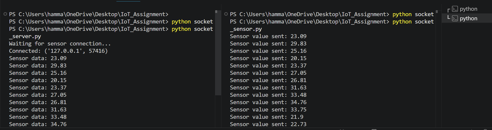
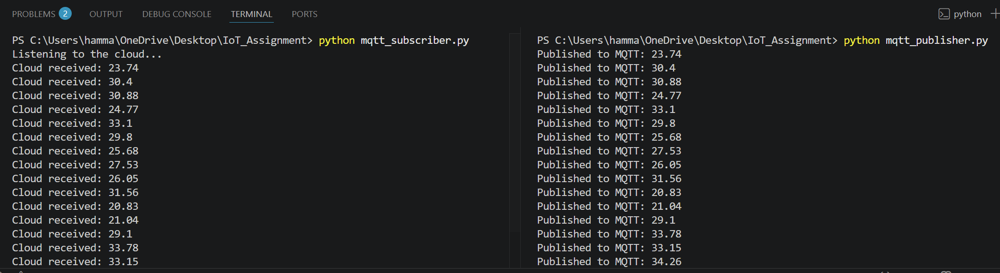
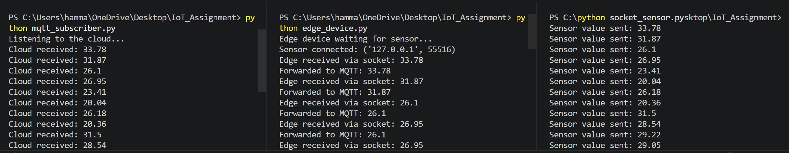

# IoT Data Pipeline: Sockets to MQTT

This repository contains a simulated IoT communication pipeline that models a complete data flow from a sensor to the cloud. The system features three main components: a Sensor Node, an Edge Device, and a Cloud Server. Direct device-to-device communication is achieved via Python socket programming, while edge-to-cloud messaging is handled through the MQTT protocol.

## System Architecture Diagram

Because this lab was simulated locally on a single machine, all components run on localhost while mirroring standard IoT architecture data flows:

```markdown
  [ Sensor Node ]                 [ Edge Device ]                 [ Cloud Server ]
(socket_sensor.py)               (edge_device.py)              (mqtt_subscriber.py)
        |                               |                               |
        |======= Local Socket =========>|                               |
        |    (Port 5000)                |                               |
        |                               |======== MQTT Publish ========>|
        |                               |     (broker.emqx.io)          |
```

## Network & Configuration Details

* **IP Addresses:** The sensor client connects to `127.0.0.1` (Localhost) to simulate local communication. The edge device's socket server is bound to `0.0.0.0`, allowing it to listen on all available network interfaces.
* **MQTT Broker:** `broker.emqx.io` (Public EMQX broker).
* **MQTT Topic:** `savonia/iot/temperature`.

## 📸 Communication Screenshots

### 1. Socket Communication (Sensor to Edge)


### 2. MQTT Messages (Edge to Cloud)


### 3. Full Integration (Lab 3 Pipeline)


## How to Run the Pipeline

To execute the fully integrated system, where the edge device receives sensor data via sockets and forwards it to the cloud via MQTT, open three separate terminal windows and run the scripts in this exact order:

1. **Start the Cloud Server:** `python mqtt_subscriber.py`
2. **Start the Edge Device:** `python edge_device.py`
3. **Start the Sensor Node:** `python socket_sensor.py`
```
