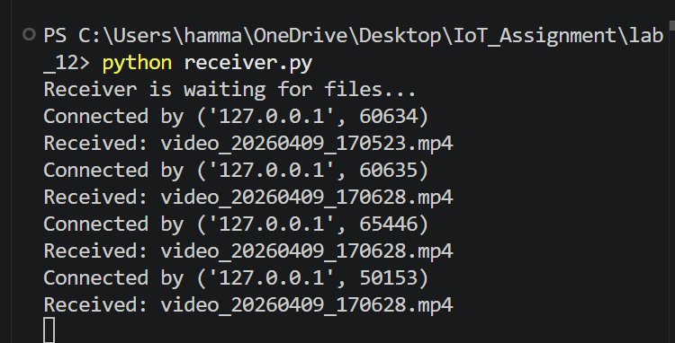
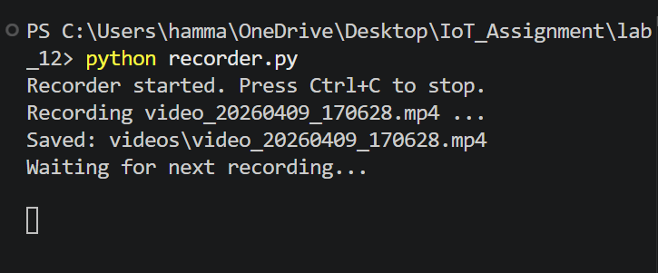
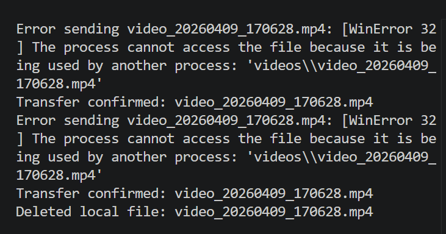
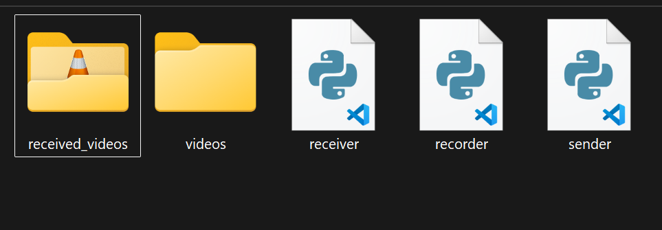

# Automated IoT Video Pipeline

This repository contains an automated large-data IoT pipeline. The system is designed to record video clips at regular intervals, transfer them over a network using a custom TCP protocol, and perform local storage cleanup only after the receiver confirms a successful transfer.

## System Overview 

The pipeline follows a strict "Record -> Save -> Send -> Confirm -> Delete" workflow to ensure data integrity and manage local edge storage efficiently.

* **Sender Role:** Laptop A (Simulated locally) runs the recorder and sender scripts.
* **Receiver Role:** Laptop B (Simulated locally) runs the receiver script to store the incoming data.
* **Receiver IP Address:** `127.0.0.1` (Localhost used for single-laptop simulation).

## Components

### 1. Video Recorder (`recorder.py`)
Automatically captures a 10-second video clip using the webcam every 2 minutes. The files are timestamped and saved in a local `videos/` folder.

### 2. Video Sender (`sender.py`)
Continuously monitors the local folder for new `.mp4` files. Once a file is detected, it connects to the receiver via a socket, transmits the data, and waits for an "OK" confirmation.

### 3. Video Receiver (`receiver.py`)
Listens for incoming connections, receives the file name and data, saves the file to the `received_videos/` folder, and sends back a confirmation code.

## Lab Requirements Verification

* **Automated System:** The system successfully recorded, transferred, and managed files without manual intervention.
* **Confirmation-Based Deletion:** The sender script was verified to delete the local video file *only* after receiving the `OK` signal from the receiver. If the transfer fails, the file remains in the local buffer to be retried later.
* **Network Protocol:** Communication was established using Python's `socket` library over TCP port 5001.

## Screenshots

### 1. Receiver Running

### 2. Recorder Running

### 3. Sender Running

### 4. Storage Evidence

## How to Run the System

1. Open three separate terminal windows.
2. **Terminal 1 (Receiver):** `python receiver.py`
3. **Terminal 2 (Recorder):** `python recorder.py`
4. **Terminal 3 (Sender):** `python sender.py`
