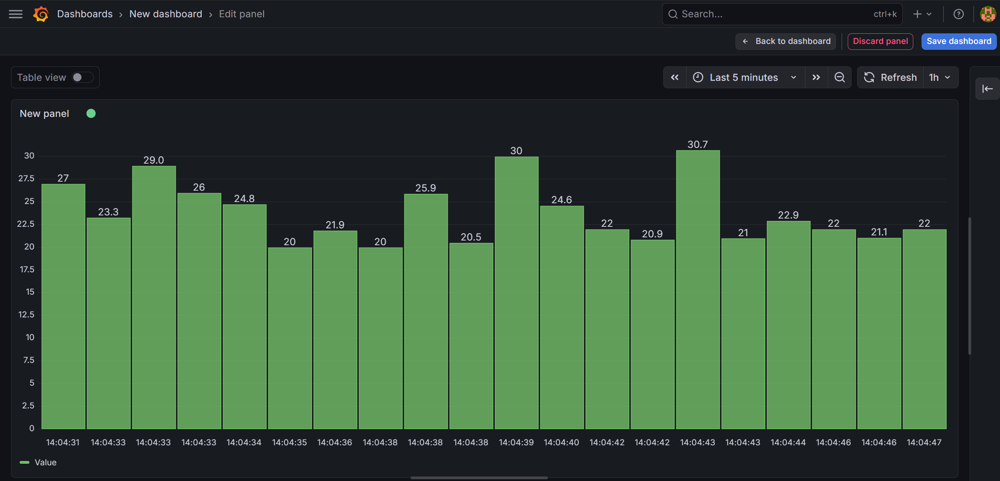

# IoT Real-Time Monitoring Dashboard

## System Overview
This project simulates an end-to-end IoT data pipeline. It features a simulated sensor that generates temperature data, an edge device that acts as a gateway, a public message broker, and a real-time visualization dashboard. 

### Data Flow
* **Socket Data Flow:** The sensor script (`socket_sensor.py`, representing Laptop 1) connects via TCP socket communication to the edge device script (`edge_device.py`, representing Laptop 2). In this implementation, both ran locally (`127.0.0.1` on port `65432`) to simulate the network flow. 
* **MQTT Publishing:** Once the edge device receives the temperature data over the socket, it forwards it to the internet by publishing the values to a public MQTT broker.

### MQTT Configuration
* **Broker Used:** `broker.emqx.io` (Port 1883)
* **MQTT Topic Used:** `savonia/iot/temperature`

---

## Grafana Dashboard Configuration

 
*(Note: Ensure your uploaded image file matches the name in the markdown link above)*

**Panel Explanation:** The panel above displays a real-time bar chart of the incoming temperature data. The X-axis represents the live timestamps as the data arrives, and the Y-axis represents the temperature values in Celsius (ranging between 20°C and 30°C). 

**Limitation of Live-Only MQTT Visualization:**
The standard Grafana MQTT data source plugin is designed strictly for live monitoring streams. It does not have an internal database to store event history. Because there is no storage backend (such as Loki or InfluxDB attached), historical data is not saved; if you refresh the dashboard or look for data from yesterday, it will not be available.

---

## Reflection Questions

**1. What is the role of Grafana in this system?**
Grafana acts as the presentation and visualization layer of the IoT system. It translates the raw, continuous stream of numbers coming from the MQTT broker into a human-readable, graphical interface, allowing users to easily monitor the current state of the sensors in real-time.

**2. Why is MQTT useful for monitoring applications?**
MQTT is a lightweight, low-bandwidth, publish-subscribe messaging protocol. It is highly efficient for IoT applications because it requires very little processing power and battery life from edge devices. Additionally, its publish-subscribe model decouples the sensors from the dashboards—the sensor simply sends data to the broker without needing to know who is listening or how to connect to them directly.

**3. What is the difference between live monitoring and historical storage?**
Live monitoring only provides a real-time view of current events as they happen, much like looking through a window; once the moment passes, the data is gone. Historical storage involves saving that incoming data into a permanent database (like a time-series database) so it can be queried later. Historical storage allows you to look back at past data to analyze long-term trends, find anomalies, or generate reports.
