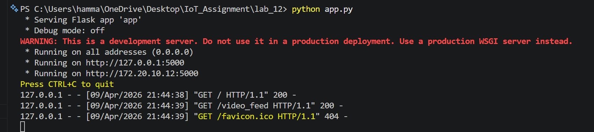
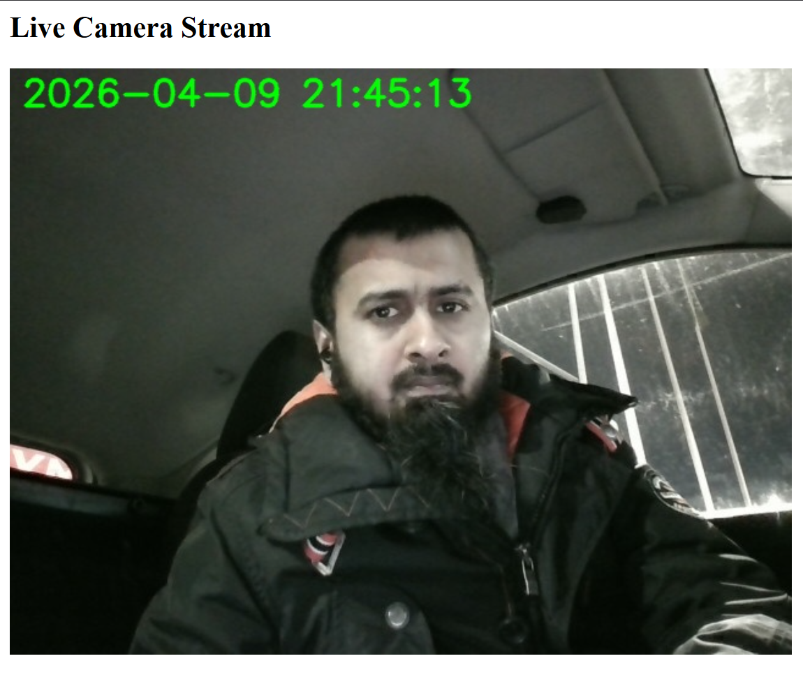

# IoT Real-Time Home Monitoring Stream

This project implements a real-time IoT video streaming pipeline. It utilizes OpenCV to capture webcam frames and a Python Flask server to broadcast the live video feed over a local network to a web browser viewer.

## System Setup
* **Sender / Camera Node:** Laptop A (Simulated locally via `app.py`)
* **Viewer / Receiver Node:** Laptop B (Simulated locally via Web Browser)
* **IP Address Used:** `127.0.0.1` (Localhost)

## Execution & Results

**How the stream was started:**
The streaming server was initialized by running `python app.py` in the terminal. Once the Flask server successfully started binding to `0.0.0.0:5000`, the viewer laptop connected to the stream by navigating to `http://127.0.0.1:5000` in a standard web browser.

**Did the viewer successfully watch the stream?**
Yes. The browser successfully connected to the Flask endpoint, and the live webcam video was displayed and updated continuously in real-time. 

**Bonus Feature Implemented:**
As per the bonus task, the OpenCV `putText()` function was used to draw a live, real-time timestamp directly onto the video frames before they are encoded and streamed to the browser.

**Problems and Fixes:**
Because the lab was simulated on a single laptop, typical network connectivity issues (like Windows Firewall blocking port 5000 over WiFi) were bypassed. The only issue encountered was broken HTML syntax in the lab manual instructions, which was fixed in the final Python code by using a proper multi-line string return for the index route.

## Proof of Execution

### 1. Flask Server Running

### 2. Browser Stream Live

