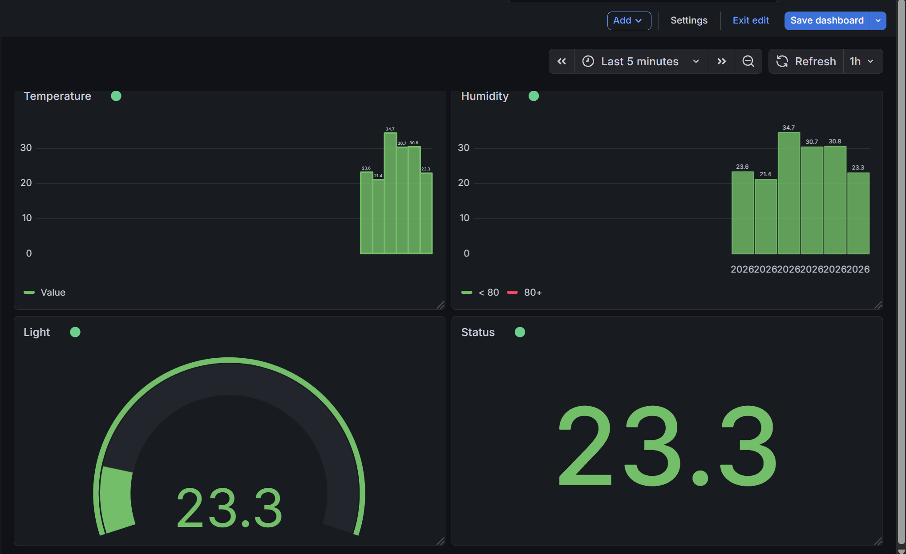

# Multi-Sensor IoT Monitoring Dashboard

## System Overview
This project expands upon a standard IoT pipeline to handle structured data streams from multiple simulated sensors. A sensor node generates temperature, humidity, and light data, packing it into a single payload. An edge device receives this payload over a local socket connection, unpacks it, and routes the individual data points to specific MQTT topics for live visualization in a 4-panel Grafana dashboard.

### Sensors and MQTT Topics Used
* **Temperature Sensor:** Generates values between 20-35 °C. 
  * Topic: `savonia/iot/temperature`
* **Humidity Sensor:** Generates values between 40-80 %. 
  * Topic: `savonia/iot/humidity`
* **Light Sensor:** Generates values between 100-1000 lux. 
  * Topic: `savonia/iot/light` 

**Broker Used:** `broker.emqx.io` (Port 1883)

---

## Grafana Dashboard Layout

*(Note: Ensure your uploaded image file matches the name in the markdown link above)*

**Explanation of Dashboard Layout:**
The dashboard is designed for quick, at-a-glance monitoring using a 3-row layout:
1. **Top Row (Temperature Graph):** A time-series or bar chart tracking historical fluctuations of temperature over the live session.
2. **Middle Row (Humidity & Light):** Two side-by-side Gauge panels providing an immediate visual representation of the current humidity percentage and light levels in lux.
3. **Bottom Row (Status Panel):** A Stat panel providing a clear, high-visibility readout of the current system status metrics.

---

## Reflection Question

**Why do we separate each sensor into a different MQTT topic?**
We separate sensors into different topics to ensure **scalability, efficiency, and decoupling**. 

If all data was sent to a single topic, every subscriber (like a dashboard, a database, or a smart device) would be forced to receive the entire payload and spend processing power sorting out the data they actually need. By using granular topics (e.g., `/temperature` vs `/light`), subscribers can subscribe *only* to the specific data stream they care about. For example, an automated window-blind system only needs to subscribe to the `savonia/iot/light` topic, saving bandwidth and keeping the system efficient.
