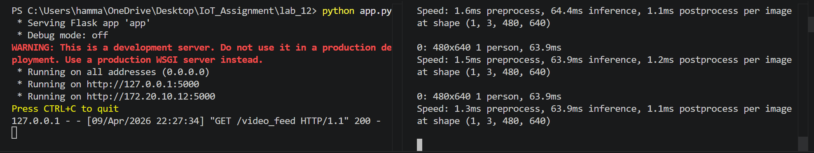
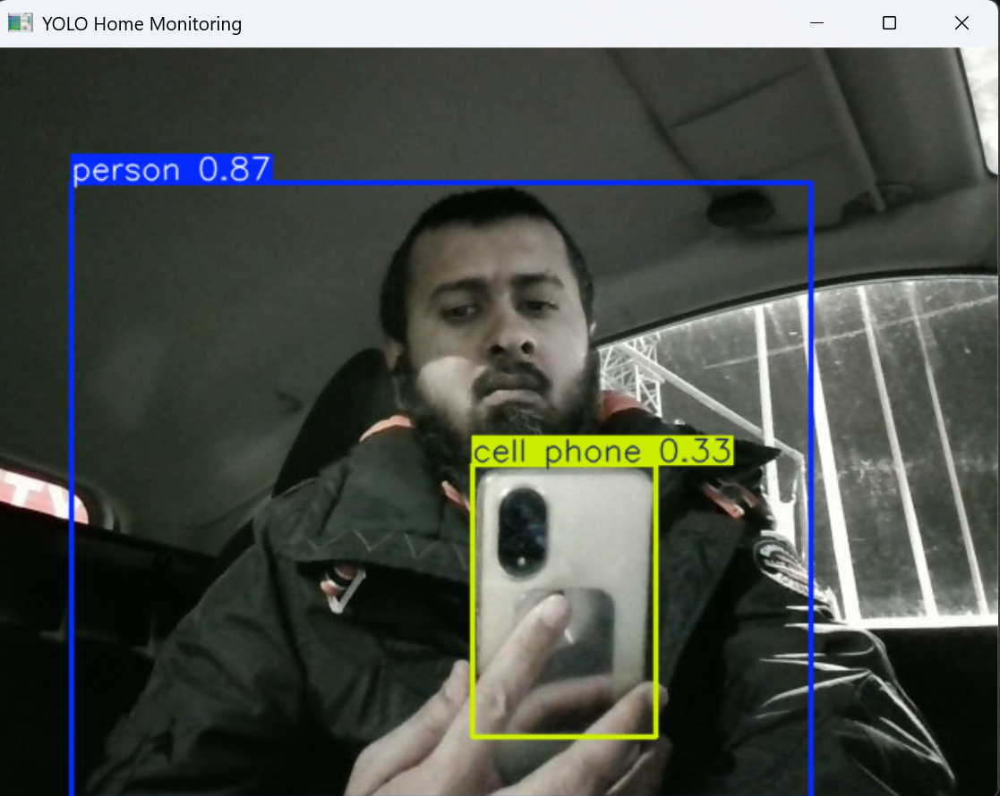

# AI-Enabled Smart Home Monitoring System

This project implements an intelligent IoT monitoring pipeline. It streams live video over a local network using Flask, receives the stream via OpenCV, and applies the YOLOv8 AI model to detect and classify objects in real-time.

## System Architecture
* **Camera / Sender Node:** Laptop A (Simulated locally via `app.py`)
* **AI / Receiver Node:** Laptop B (Simulated locally via `yolo_stream.py`)
* **Stream Address:** `http://127.0.0.1:5000/video_feed` (Localhost)

## Execution & Functionality

**How the stream was started:**
The video feed was initialized by running `python app.py`, which binds the webcam to a Flask web server on port 5000. 

**How YOLO was run:**
Once the stream was active, `python yolo_stream.py` was executed. This script utilizes the `ultralytics` YOLOv8n (nano) model to ingest the network stream frame-by-frame, process the image, and draw bounding boxes around identified objects.

**Objects Detected:**
During testing, the YOLO model successfully recognized and labeled several objects in the frame, including a person. 

**Bonus Feature Implemented:**
The system includes logic to act as a security camera. If the YOLO model detects a "person" (Class 0), the system automatically captures and saves the current frame to the local directory as `person_detected_XX.jpg`. A 5-second cooldown was implemented to prevent storage flooding.

**Problems and Fixes:**
Running both the Flask server and the YOLO model on a single machine requires careful management of the webcam resource. To avoid "Camera not opening" errors, it was ensured that no other applications (like Zoom or Teams) were using the webcam, and the Flask server was fully running before the YOLO script attempted to pull the stream.

## Proof of Execution

### 1. Flask Streaming Server

### 2. YOLO Real-Time Detection

### 3. Bonus Task Output

