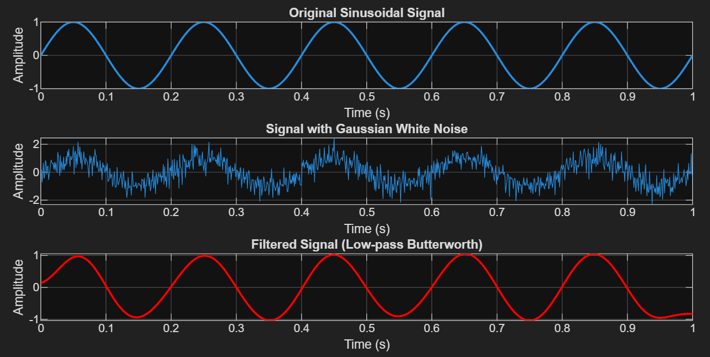

# Signal Noise Reduction with Butterworth Filter

This repository contains a MATLAB implementation for simulating a sinusoidal signal, injecting it with Gaussian White Noise (GWN), and recovering the original signal using a zero-phase low-pass Butterworth filter.

## Features

* **Signal Generation:** Creates a pure 5 Hz sine wave.
* **Noise Simulation:** Adds Gaussian White Noise with a configurable standard deviation.
* **Butterworth Filtering:** Utilizes a 4th order Butterworth filter to isolate low-frequency components.
* **Zero-Phase Distortion:** Uses the `filtfilt` function to ensure no phase shift occurs during the filtering process, maintaining temporal alignment with the original signal.

## Visual Results

The script generates a comparison between the ground truth, the corrupted signal, and the processed output.



---

## Technical Details

### Filter Configuration
The script applies a digital low-pass filter with the following parameters:
* **Sampling Frequency (fs):** 1000 Hz
* **Cutoff Frequency (fc):** 10 Hz
* **Filter Order:** 4
* **Normalized Cutoff (Wn):** Calculated as fc / (fs / 2)

### Prerequisites
* MATLAB (R2016b or later recommended)
* Signal Processing Toolbox

## How to Use
1. Clone this repository.
2. Open MATLAB and navigate to the project folder.
3. Run the script:
   ```matlab
   noise_simulation.m
