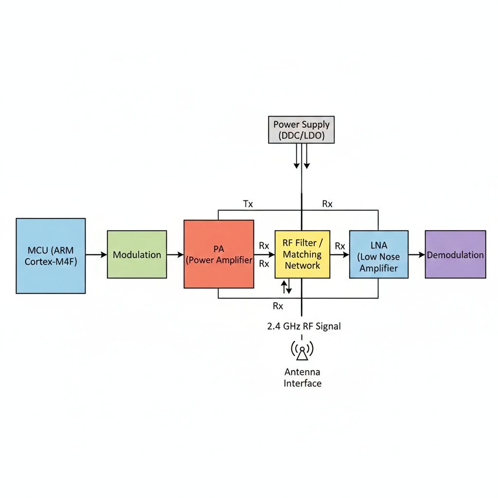

# Project 3: RF System Decomposition

## Student Information
* **Name:** Hammad Khalid
* **Student ID:** S2416301

## Device Selection
* **Selected Device:** Nordic Semiconductor nRF52840 (BLE SoC)
* **Datasheet Link:** [nRF52840 Product Specification v1.1](https://docs.nordicsemi.com/bundle/nRF52840_PS_v1.1/resource/nRF52840_PS_v1.1.pdf)

---

## RF System Block Explanations

### 1. Information Source / MCU
The **ARM® Cortex®-M4F** processor serves as the system's central controller. It executes the application code and manages the Bluetooth Low Energy (BLE) protocol stack, generating the digital data for transmission and interpreting data received from the radio.

### 2. RF Transceiver
The transceiver is a high-performance 2.4 GHz radio that supports multiple protocols. Its primary role is to handle the physical layer of communication, enabling the chip to toggle seamlessly between transmitting (Tx) and receiving (Rx) states.

### 3. Modulation / Demodulation
This block performs **Gaussian Frequency Shift Keying (GFSK)**. During transmission, it converts digital binary data into frequency-shifted analog signals; during reception, it extracts the digital bitstream from the incoming analog waveform.

### 4. Power Amplifier (PA)
The integrated PA increases the power of the generated RF signal before it reaches the antenna. It allows for programmable output power (up to +8 dBm), which is essential for determining the communication range and reliability of the wireless link.

### 5. Low Noise Amplifier (LNA)
The LNA is the first component in the receive chain, responsible for amplifying weak incoming signals from the antenna. It is designed to provide high gain while introducing minimal noise, ensuring the radio can detect distant or low-power signals.

### 6. RF Filtering / Matching Network
This block consists of passive components that ensure the impedance of the radio matches the antenna (typically 50 ohms). It also acts as a band-pass filter to suppress unwanted harmonics and out-of-band emissions to meet regulatory requirements.

### 7. Antenna Interface
The antenna interface (the **ANT pin**) is the physical port where the RF energy is transferred to the antenna. In this system, it handles the bidirectional flow of the signal, acting as the bridge between the PCB circuitry and the electromagnetic environment.

### 8. Power Supply for RF Section
The RF section is powered by internal **DC/DC converters and LDO regulators**. These provide a clean, stable voltage supply that isolates the sensitive analog radio components from the electrical noise generated by the high-speed digital MCU.

---

## RF Block Diagram

